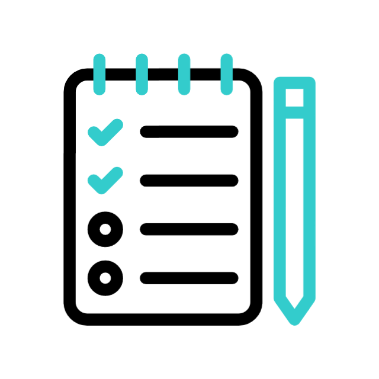

# To Do App - By Marcelo Pena

## Description

A simple To Do List app built with HTML, CSS, and JavaScript. This app allows users to create, update, delete, and mark tasks as completed. The tasks are stored in the browser's local storage, ensuring they persist even after page reloads.

## Features

- Add new tasks to the list.
- Edit existing tasks.
- Delete tasks from the list.
- Mark tasks as completed (tasks are visually crossed out).
- Persist tasks in local storage.
- Clear and responsive UI for easy interaction.

## Screenshots



## Setup

### Prerequisites

- A modern web browser (Google Chrome, Firefox, etc.)

### Installation

1. Clone the repository:
   ```bash
   git clone https://github.com/CoderPena/to-do-app.git
